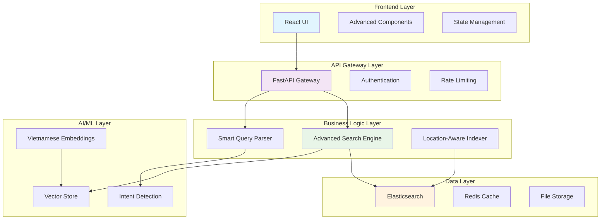

# 🏗️ Architecture Overview

> **OneU AI Voucher Assistant - System Architecture Documentation**

## 📋 Table of Contents
- [High-Level Architecture](#high-level-architecture)
- [Component Details](#component-details)
- [Data Flow](#data-flow)
- [Technology Stack](#technology-stack)
- [Scalability Considerations](#scalability-considerations)

## 🏗️ High-Level Architecture



## 🔧 Component Details

### 1. Frontend Layer
```typescript
// Advanced Voucher Search Component
interface SearchProps {
  onSearch: (query: string) => Promise<SearchResult[]>;
  onClear: () => void;
  loading: boolean;
}

// Real-time search with debouncing
const AdvancedVoucherSearch: React.FC<SearchProps> = ({ onSearch, loading }) => {
  // Implementation with TypeScript + React Hooks
}
```

**Key Components:**
- **React UI**: Modern component-based interface
- **TypeScript**: Type-safe development
- **State Management**: Efficient state handling
- **Real-time Updates**: Live search results

### 2. API Gateway Layer
```python
# FastAPI Main Application
from fastapi import FastAPI, HTTPException
from fastapi.middleware.cors import CORSMiddleware

app = FastAPI(
    title="OneU AI Voucher Assistant",
    description="Advanced voucher search and recommendation system",
    version="1.0.0"
)

@app.post("/api/advanced-search")
async def advanced_search(request: AdvancedSearchRequest):
    """
    Hybrid search endpoint combining exact text and semantic search
    """
    # Implementation details
```

**Features:**
- **RESTful APIs**: Clean and consistent endpoints
- **OpenAPI Documentation**: Auto-generated API docs
- **CORS Support**: Cross-origin resource sharing
- **Error Handling**: Comprehensive error responses

### 3. Business Logic Layer

#### Smart Query Parser
```python
class SmartQueryParser:
    """
    Advanced query parsing for Vietnamese natural language
    """
    
    def parse_query(self, query: str) -> QueryComponents:
        # Intent detection
        intent = self._detect_intent(query)
        
        # Location extraction
        location = self._extract_location(query)
        
        # Service type classification
        service_type = self._classify_service_type(query)
        
        return QueryComponents(
            intent=intent,
            location=location,
            service_type=service_type,
            confidence=self._calculate_confidence()
        )
```

#### Advanced Search Engine
```python
class AdvancedVectorStore:
    """
    Multi-field embedding strategy with hybrid search
    """
    
    async def advanced_vector_search(
        self, 
        query: str, 
        top_k: int = 10
    ) -> List[SearchResult]:
        # Hybrid search: Exact text + Semantic similarity
        search_body = {
            "query": {
                "bool": {
                    "should": [
                        # Exact text search (high boost)
                        {"multi_match": {...}},
                        # Semantic search
                        {"script_score": {...}}
                    ]
                }
            }
        }
```

### 4. AI/ML Layer

#### Vietnamese Embeddings
```python
from sentence_transformers import SentenceTransformer

class EmbeddingService:
    def __init__(self):
        self.model = SentenceTransformer("dangvantuan/vietnamese-embedding")
        self.dimension = 768
    
    def create_multi_field_embeddings(self, voucher_data):
        """
        Generate specialized embeddings for different fields
        """
        embeddings = {
            'content': self.model.encode(voucher_data.content),
            'location': self.model.encode(f"Địa điểm: {voucher_data.location}"),
            'service': self.model.encode(f"Dịch vụ: {voucher_data.service_type}"),
            'target': self.model.encode(f"Đối tượng: {voucher_data.target_audience}")
        }
        return embeddings
```

## 🔄 Data Flow

### Search Request Flow
```
1. User Query Input
   ↓
2. Frontend Validation & Debouncing
   ↓
3. API Gateway (Authentication + Rate Limiting)
   ↓
4. Smart Query Parser
   ├── Intent Detection
   ├── Location Extraction
   └── Service Classification
   ↓
5. Advanced Search Engine
   ├── Query Embedding Generation
   ├── Hybrid Search Execution
   └── Result Ranking & Filtering
   ↓
6. Response Formatting
   ↓
7. Frontend Display
```

### Data Indexing Flow
```
1. Excel Data Import
   ↓
2. Data Cleaning & Validation
   ↓
3. Multi-field Component Extraction
   ├── Location Normalization
   ├── Service Type Classification
   └── Target Audience Detection
   ↓
4. Embedding Generation
   ├── Content Embeddings
   ├── Location Embeddings
   ├── Service Embeddings
   └── Combined Embeddings
   ↓
5. Elasticsearch Indexing
   ├── Document Creation
   ├── Mapping Configuration
   └── Index Optimization
```

## 💾 Technology Stack

### Backend Technologies
```yaml
Core Framework:
  - FastAPI: "Modern Python web framework"
  - Uvicorn: "ASGI server for production"
  - Pydantic: "Data validation and serialization"

Search & AI:
  - Elasticsearch: "Vector search and text indexing"
  - Sentence Transformers: "Vietnamese language embeddings"
  - Scikit-learn: "Additional ML utilities"

Data Processing:
  - Pandas: "Data manipulation and analysis"
  - NumPy: "Numerical computing"
  - Openpyxl: "Excel file processing"
```

### Frontend Technologies
```yaml
Core Framework:
  - React 18: "Modern UI library"
  - TypeScript: "Type-safe JavaScript"
  - Create React App: "Development setup"

Styling & UI:
  - CSS Modules: "Scoped styling"
  - Flexbox/Grid: "Modern layouts"
  - Responsive Design: "Mobile-first approach"

HTTP & State:
  - Axios: "HTTP client"
  - React Hooks: "State management"
  - Error Boundaries: "Error handling"
```

## 📊 Scalability Considerations

### Horizontal Scaling
```yaml
Load Balancing:
  - Multiple FastAPI instances
  - Nginx as reverse proxy
  - Session-less design

Database Scaling:
  - Elasticsearch cluster
  - Shard distribution
  - Replica configuration

Caching Strategy:
  - Redis for frequent queries
  - Application-level caching
  - CDN for static assets
```

### Performance Optimization
```yaml
Backend Optimization:
  - Async/await patterns
  - Connection pooling
  - Query optimization
  - Response compression

Frontend Optimization:
  - Code splitting
  - Lazy loading
  - Memoization
  - Bundle optimization

AI/ML Optimization:
  - Model quantization
  - Batch processing
  - Vector caching
  - Embedding compression
```

### Monitoring & Observability
```yaml
Logging:
  - Structured logging (JSON)
  - Log aggregation (ELK stack)
  - Error tracking
  - Performance metrics

Monitoring:
  - Health checks
  - API metrics
  - Search performance
  - Resource utilization

Alerting:
  - System alerts
  - Performance degradation
  - Error rate thresholds
  - Capacity planning
```

## 🔒 Security Architecture

### API Security
```python
# JWT Authentication
from fastapi_users.authentication import JWTAuthentication

# Rate limiting
from slowapi import Limiter, _rate_limit_exceeded_handler

# Input validation
from pydantic import BaseModel, validator

class SearchRequest(BaseModel):
    query: str
    top_k: int = 10
    
    @validator('query')
    def validate_query(cls, v):
        if len(v.strip()) < 2:
            raise ValueError('Query too short')
        return v.strip()
```

### Data Protection
- **Input Sanitization**: XSS prevention
- **SQL Injection Protection**: Parameterized queries
- **Rate Limiting**: API abuse prevention
- **CORS Configuration**: Cross-origin protection

## 🚀 Deployment Architecture

### Development Environment
```yaml
Local Development:
  - Docker Compose
  - Hot reloading
  - Development databases
  - Debug logging

Testing Environment:
  - Automated testing
  - CI/CD pipeline
  - Staging data
  - Performance testing
```

### Production Environment
```yaml
Container Orchestration:
  - Kubernetes clusters
  - Auto-scaling policies
  - Health monitoring
  - Rolling deployments

Infrastructure:
  - Load balancers
  - CDN integration
  - Database clustering
  - Backup strategies
```

---

**Next**: [📡 API Documentation](./API.md)
